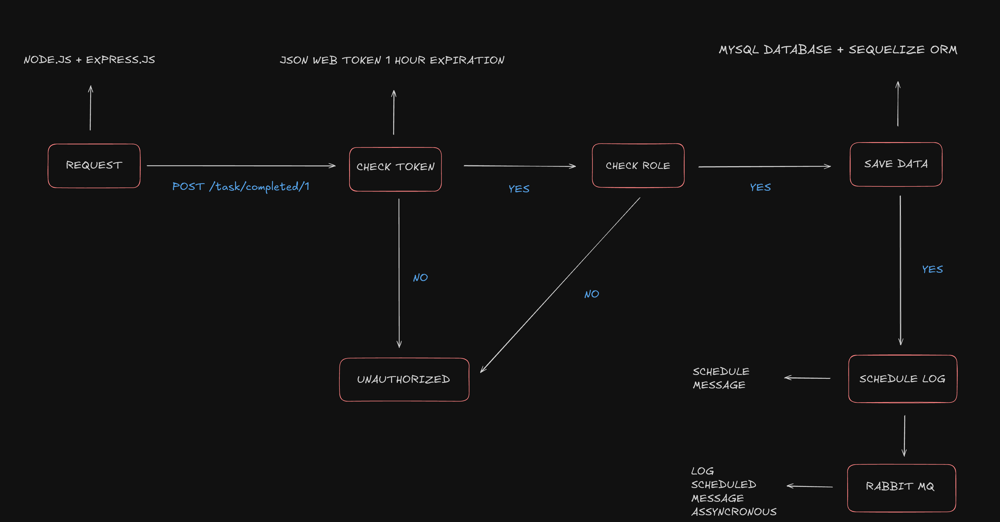

# Sword Health Tasks API


## Table of Contents
- [Requirements](#requirements)
- [Features](#features)
- [Tech Requirements](#tech-requirements)
- [Installation](#installation)
- [Testing](#testing)
- [Tech stack](#tech-stack)
- [Documentation](#documentation)
- [Roles](#roles)
- [System Design](#system-design)

## Requirements
You are developing software to account for maintenance tasks performed during a working day. This application has two types of users: Manager and Technician.

- **Technician**: Performs tasks and can only see, create, or update their own tasks.
- **Manager**: Can see tasks from all technicians, delete them, and should be notified when a technician performs a task.

A task has a summary (max: 2500 characters) and a date when it was performed. The summary can contain personal information.

### Notes
- If you don’t have enough time to complete the test, prioritize complete features (with tests) over many features.
- We’ll evaluate security, quality, and readability of your code.
- This test is suitable for all levels of developers, so make sure to prove yours.

## Features
- **Create API endpoint to save a new task**
- **Create API endpoint to list tasks**
- **Notify manager of each task performed by the technician**
  - This notification can be a print statement saying “The tech X performed the task Y on date Z”
  - This notification should not block any HTTP request.

## Tech Requirements
- Use either Go or Node to develop this HTTP API.
- Create a local development environment using Docker containing this service and a MySQL database.
- Use MySQL database to persist data from the application.
- Features should have unit tests to ensure they are working properly.

### Bonus
- Use a message broker to decouple notification logic from the application flow.
- Create Kubernetes object files needed to deploy this application.

## Installation
1. Clone the repository
```bash
git clone https://github.com/RazielRodrigues/sword-health-tasks-api.git
```
2. Change to the project directory
```bash
cd sword-health-tasks-api
```
3. Run the docker-compose
```bash
docker compose up --build
```
3. Access the API
```bash
http://localhost:3000/
```

## Testing


- Run tests
```bash
docker exec -it sword_health_tasks_api_node npm run test:unit
docker exec -it sword_health_tasks_api_node npm run test:integration
```
- Access coverage (accessing index.html in coverage folder)
```bash
docker exec -it sword_health_tasks_api_node npm run test:coverage
```

## Tech stack
- NodeJS (Javascript)
- RabbitMQ
- Docker
- Vercel
- MySQL
- GIT
- CORS
- Express JS
- JWT
- Sequelize ORM
- Mocha
- Axios
- Chai
- NYC
- Sequelize Mock
- Sinon

## Documentation
- <a href="https://github.com/RazielRodrigues/sword-health-tasks-api/blob/main/doc/sword_health_tasks_api_postman_collection.json"> Postman Documentation </a>
- Create your user
- Login with your user and grab the token
- Add the token in the header and start using the API

## Roles

### User route
- create: OPEN
- read: ROLE_MANAGER
- update: ROLE_MANAGER & ROLE_TECHNICIAN
- delete: ROLE_MANAGER

### Task route
- create: ROLE_TECHNICIAN
- read: ROLE_MANAGER (read all) & ROLE_TECHNICIAN (read own)
- update: ROLE_TECHNICIAN
- delete: ROLE_MANAGER
- completed: ROLE_TECHNICIAN

## System Design
- <a href="https://excalidraw.com/#json=qcFODiZAH89AuAvciK1JF,xQCK1SWMCI5o5NsR9b3iog"> Diagram </a>


## Database


## Further improvements
- encryption summary field
- database migration
- deploy
- separate test database
- docker env